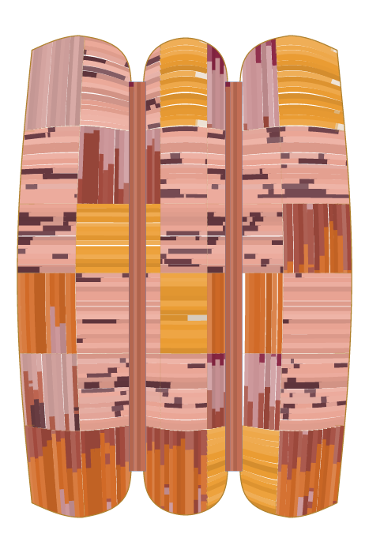
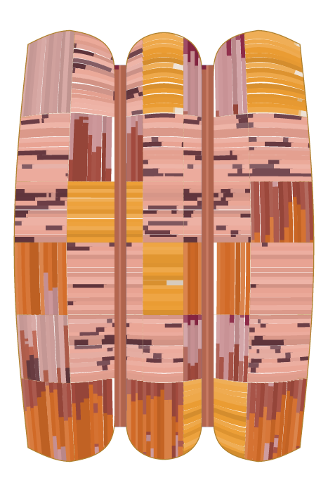
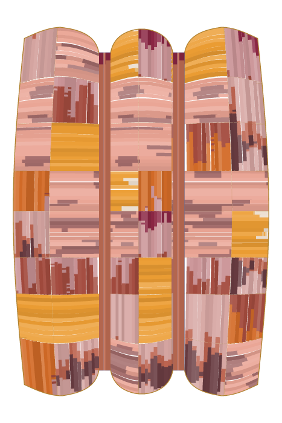
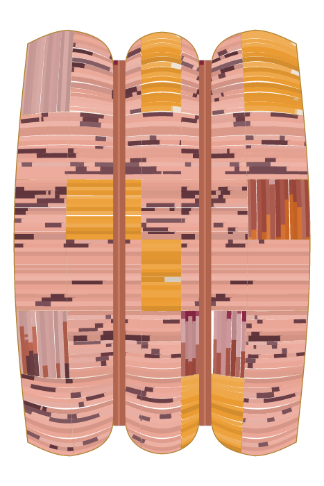
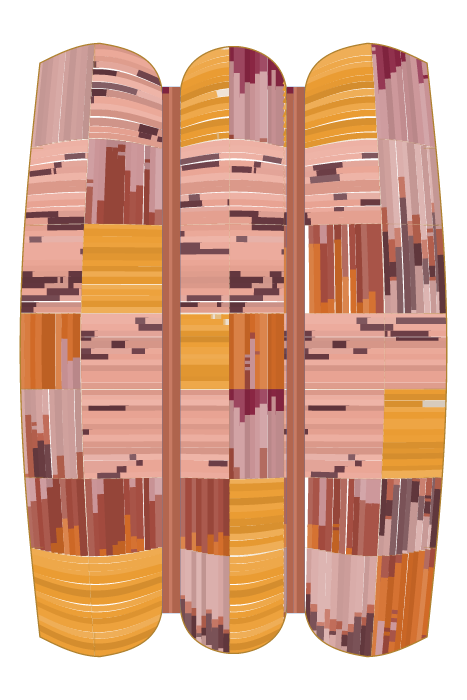
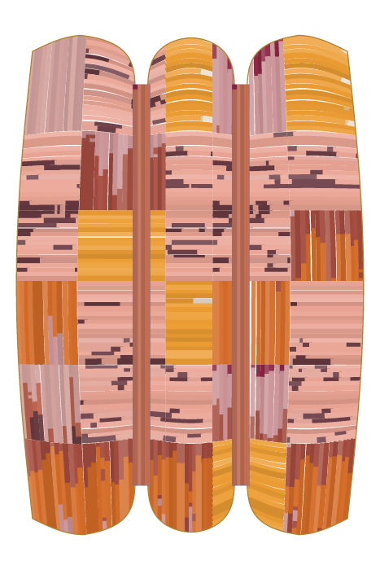
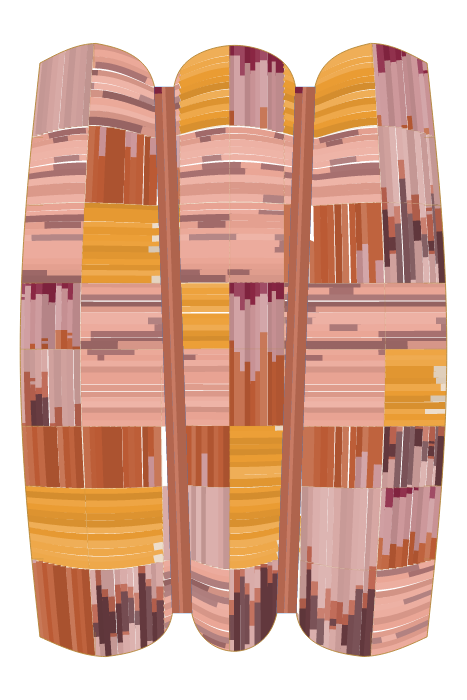

# brief-1787183860194-0c4f3666

> two vertical ribbons

Rounds run: 5. Spend: $9.01.

| rank | variant | rating | disagreement | source |
|---|---|---|---|---|
| 1 | r5-var-23 | 1692 | 0% | openai (Clementine) |
| 2 | r4-var-26 | 1668 | 0% | mechanical |
| 3 | r5-var-11 | 1668 | 0% | mechanical |
| 4 | r5-var-15 | 1620 | 0% | mechanical |
| 5 | r5-var-01 | 1596 | 0% | anthropic (Bernard) |
| 6 | r5-var-17 | 1596 | 0% | openai (Clementine) |
| 7 | r5-var-06 | 1500 | 0% | anthropic (Bernard) |

## r5-var-23

Rating 1692 · disagreement 0% · source: openai (Clementine) · intent: Broaden and soften the two vertical ribbons so they read as calmer, heavier cloth with gentler internal variation.

For:
- "A keeps the two-ribbon structure cleaner and more legible, with stronger compositional restraint and less distracting interruption." — Maeve
- "A has a more coherent rhythmic structure and stronger vertical ribbon read, making it feel like a deliberate series decision." — Maeve
- "B's warmer, more saturated orange blocks echo the reference's glow with better tonal weight distribution across the panels." — Arnold
Against:
- "B's cleaner banding and bolder color blocking reads as a deliberate compositional rhythm rather than scattered noise." — Maeve
- "Clearer horizontal banding gives calmer weight distribution, holding the wall without the busier fragmentation of A." — Ford
- "B's banding aligns across ribbons into cohesive horizontal registers, echoing the reference's unified warm gradient." — Arnold

## r4-var-26

Rating 1668 · disagreement 0% · source: mechanical · intent: mechanical mutation

For:
- "B's smoother tonal gradients and softer block transitions echo the reference's warm, fluid glow more convincingly than A's choppier contrast." — Maeve
- "A's rhythm stays fully resolved across all three panels, reading as a complete authored composition rather than an interrupted one." — Maeve
- "A reads as a resolved textile field with stronger continuity and intentional rhythm; B’s voids break the front-room presence." — Maeve
Against:
- "B's blocking feels more deliberately staggered across panels, echoing the warm gradient shift of the reference rather than mirroring it symmetrically." — Arnold
- "A has clearer vertical ribbon structure and better proportioned color placement, making the surface divisions feel intentional." — Arnold
- "B feels more balanced and readable at a distance, with clearer vertical mass and less distracting fragmentation." — Ford

## r5-var-11

Rating 1668 · disagreement 0% · source: mechanical · intent: mechanical mutation (fallback after generator failure)

For:
- "B balances warm ochre against mauve more evenly across all three panels, echoing the reference's golden warmth with less patchwork clutter." — Arnold
- "A reads more as two stable vertical ribbons from across the room, with clearer massing and less distracting visual chatter." — Ford
- "B has clearer vertical ribbon structure and better-balanced tonal blocks, giving the surface more deliberate proportion." — Arnold
Against:
- "A feels more resolved and rhythmic, with clearer vertical ribbon structure and stronger authored variation across the three panels." — Maeve
- "B's finer speckled texture and varied block scale feels more deliberate and hand-worked than A's flatter, blockier patchwork." — Maeve
- "B's finer, more textured striations echo the reference's subtle tonal gradation better than A's blockier patches." — Arnold

## r5-var-15

Rating 1620 · disagreement 0% · source: mechanical · intent: mechanical mutation (fallback after generator failure)

For:
- "A reads as three continuous ribbons with a single rhythm, while B's mirrored seam breaks the vertical flow the brief asks for." — Arnold
- "A commits to a single vertical gesture with confident asymmetric color blocks, while B's mirrored split reads as a template." — Maeve
- "A has clearer vertical structure and more disciplined color placement, matching the reference’s restrained tonal rhythm." — Arnold
Against:
- "A's bolder saturated blocks and rhythmic banding echo the reference's warm glow with more confident, purposeful placement of colour." — Arnold
- "B's warmer, more saturated orange blocks echo the reference's golden tonality with better weight distribution across the panels." — Arnold
- "B's bolder vertical striations and richer orange saturation feel more deliberate and closer to the reference's warm glow." — Maeve

## r5-var-01

Rating 1596 · disagreement 0% · source: anthropic (Bernard) · intent: Tighten the grid and settle the ribbons into natural drape and rounding for a denser, more disciplined vertical pair.

For:
- "B balances warm ochre masses more evenly across the panels, echoing the reference's golden dominance with better weight distribution." — Arnold
- "A's asymmetric block placement and irregular banding feel more deliberate, less mechanically repeated than B's tidier mirroring." — Maeve
- "B has clearer vertical ribbon structure and a stronger authored rhythm, reading less generic and more like a deliberate series." — Maeve
Against:
- "B has clearer vertical rhythm and more deliberate placement of warm bands, making the ribbons feel composed rather than scattered." — Arnold
- "B's blocks feel more deliberately staggered, giving richer rhythm and better echoing the warm gradient tonality of the reference." — Arnold
- "B reads more vertically stable and wall-like, with clearer ribbon massing and less distracting fragmentation." — Ford

## r5-var-17

Rating 1596 · disagreement 0% · source: openai (Clementine) · intent: Gently widen and relax the two main ribbons, softening internal chatter while keeping a clear, vertically settled division.

For:
- "B's blocks feel more deliberately proportioned and asymmetric, echoing the reference's soft uneven tonal drift rather than mechanical repetition." — Arnold
- "A's asymmetric block placement feels like a deliberate compositional choice, while B's mirrored symmetry reads as default output." — Maeve
- "B reads as a cohesive, intentional textile with stronger rhythm and cleaner series logic; A feels interrupted and unresolved." — Maeve
Against:
- "B has cleaner vertical rhythm and more deliberate division, with the warmer bands placed more coherently across the ribbons." — Arnold
- "Crisper ribbon divisions and stronger tonal echo of the warm gradient reference give it more coherent structure." — Arnold
- "B feels more intentional and legible, with cleaner vertical rhythm and a stronger hand in the ribbon structure." — Maeve

## r5-var-06

Rating 1500 · disagreement 0% · source: anthropic (Bernard) · intent: Tighten the grid, calm the scatter, and cut bands per layer so fewer, harder-edged colour blocks carry the weight.

For:
- "Cleaner block contrasts and crisper color separations give A a more deliberate, hand-composed rhythm than B's muddier speckling." — Maeve
- "Cleaner block divisions and steadier stripe rhythm give A more disciplined proportion than B's noisier, muddier patches." — Arnold
- "A feels more balanced and architectural, with clearer vertical massing and less visual noise for a wall-hung textile." — Ford
Against:
- "B has clearer vertical division and more disciplined color placement, with better proportion between the ribbons and the tonal reference." — Arnold
- "B has clearer vertical ribbon rhythm and a more intentional, unified hand, making the composition feel stronger and less busy." — Maeve
- "B has clearer vertical ribbon structure and more deliberate tonal balance, closer to the reference's simple warm massing." — Arnold

## Win rate by source

| source | wins | total | rate |
|---|---|---|---|
| openai | 692 | 1412 | 49% |
| mechanical | 765 | 1627 | 47% |
| anthropic | 731 | 1414 | 52% |
| xai | 742 | 1407 | 53% |
